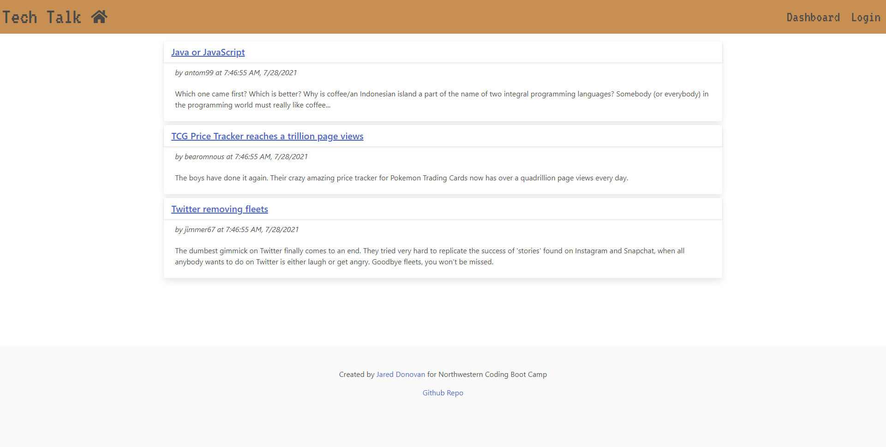
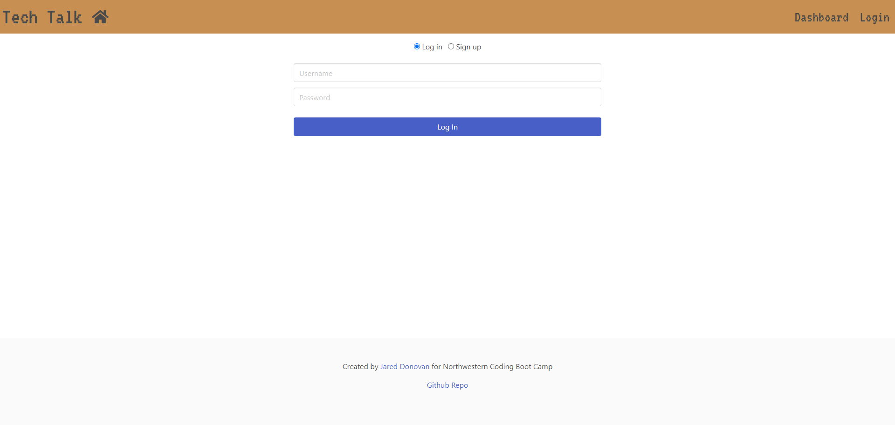
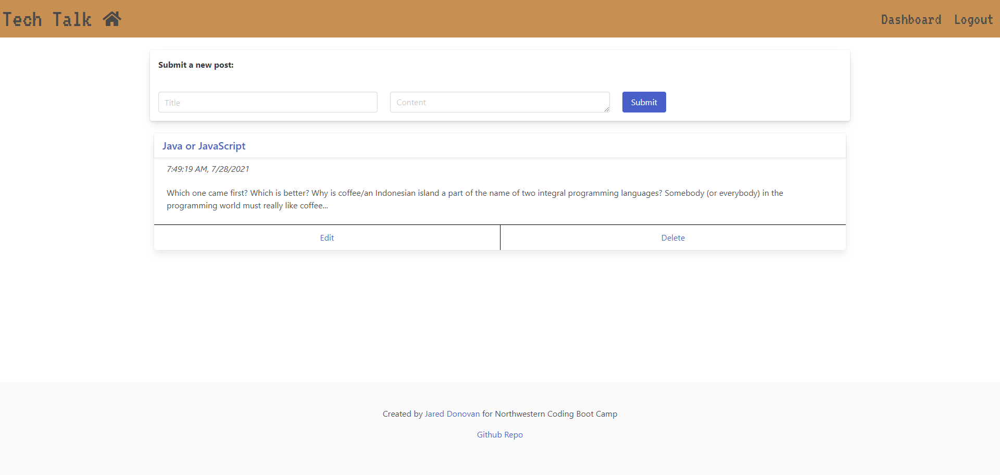
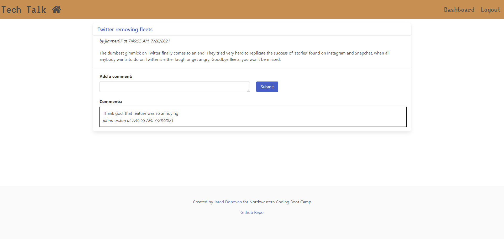

<h1 align="center"><strong>MVC Tech Blog</strong></h1>


- [<strong>Description</strong>](#description)
- [<strong>Installation</strong>](#installation)
- [<strong>Usage</strong>](#usage)
- [<strong>Screenshots</strong>](#screenshots)
- [<strong>Contributing</strong>](#contributing)
- [<strong>Questions</strong>](#questions)


## <strong>Description</strong>

This is a simple tech blog that developers can use to share technology/programming news and can comment on other user's posts. It is built using the Model View Controller (MVC) paradigm and uses Handlebars.js as the templating language, Sequelize as the object relation manager, and express-session to authenticate users.

[Check it out on heroku!](https://jd-tech-talk.herokuapp.com/)


## <strong>Installation</strong>

To look through the code or make a change, just download the repository and extract it, and open it up in a code editor! Otherwise, you can just view the site through the heroku link.


## <strong>Usage</strong>

```
AS A developer who writes about tech
I WANT a CMS-style blog site
SO THAT I can publish articles, blog posts, and my thoughts and opinions
```


## <strong>Screenshots</strong>





Dashboard screen is only able to be viewed when logged in


Comments appear under on the post's individual page



## <strong>Contributing</strong>

I may clean up the styling and pick better colors to make the website more visually appealing, but feel free to use this repository as a guide or to troubleshoot a similar project!


## <strong>Questions</strong>

Find me on GitHub: [jdono100](https://github.com/jdono100) ←_←

Or send me an email: 📤 [jdono100@gmail.com](mailto:jdono100@gmail.com) 📥

And the heroku link once again: https://jd-tech-talk.herokuapp.com/